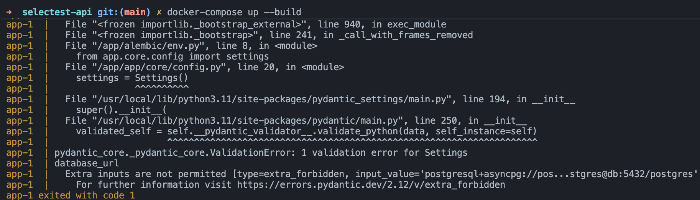
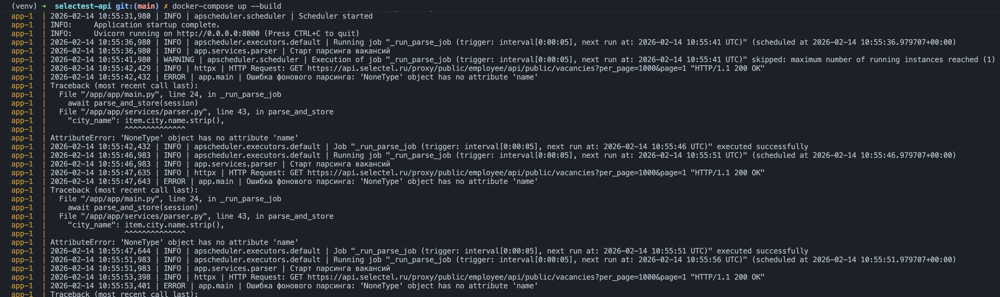
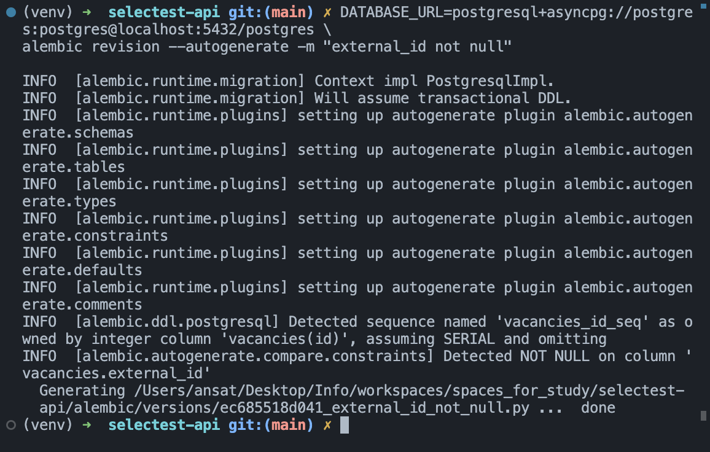
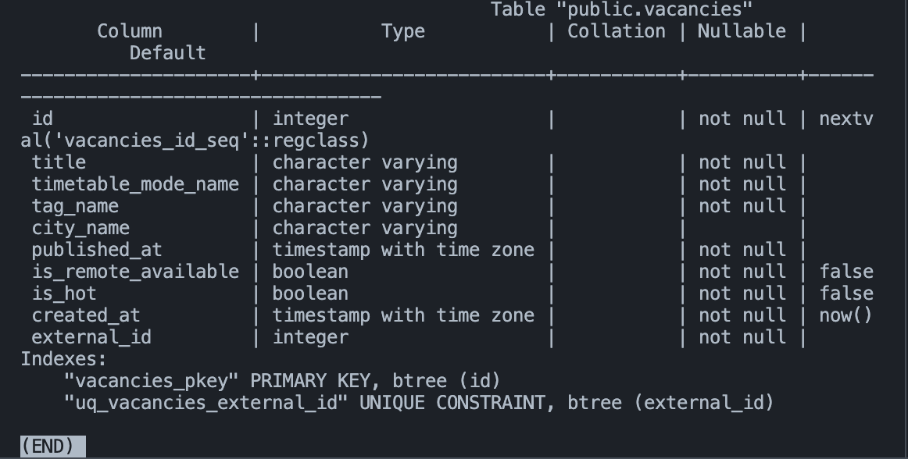

## Отчет по отладке приложения Жетписов Ансат Нурланович

### 1. Шаг 1: Анализ и запуск
* Что сделал: docker compose up --build
* Ожидание: приложение стартует, применяет миграции и поднимает API
* Факт: приложение не сможет корректно подключиться к БД, даже если .env правильный

* Проблема: Описание проблемы: в настройках опечатка в validation_alias, из-за чего переменная окружения DATABASE_URL не подхватывается, и приложение всегда использует дефолтное значение.

* Решение: Исправить опечатку.

Вложение

Код до:
>config.py
```python
database_url: str = Field(
    "postgresql+asyncpg://postgres:postgres@db:5432/postgres_typo",
    validation_alias="DATABSE_URL",
)
```
Код после:
>config.py
```
database_url: str = Field(
    "postgresql+asyncpg://postgres:postgres@db:5432/postgres_typo",
    validation_alias="DATABASE_URL",
)
```

Приложение запустилось и начался парсинг

### 2. Шаг 2: Исправление бага №2
* Что сделал: Исправляя конфиг заметил разницу

* Проблема: Даже если .env не применился/отсутствует, дефолтный DSN должен быть рабочим. Сейчас он ведёт в базу postgres_typo, которой нет (в compose создаётся POSTGRES_DB=postgres)
* Решение: Исправить DSN в конфиге чтобы он соответствовал env

Вложение

Код до:
>config.py
```python
    database_url: str = Field(
        "postgresql+asyncpg://postgres:postgres@db:5432/postgres_typo",
        validation_alias="DATABASE_URL",
    )
```
>.env
```
DATABASE_URL=postgresql+asyncpg://postgres:postgres@db:5432/postgres
```

Код после:
>config.py
```python
    database_url: str = Field(
        "postgresql+asyncpg://postgres:postgres@db:5432/postgres",
        validation_alias="DATABASE_URL",
    )
```

### 3. Шаг 3: Исправление бага №3
* Что сделал: Запуская приложение заметил, что парсинг осуществляется каждые 5 секунд, когда должен каждые 5 минут так как видел в env переменную `PARSE_SCHEDULE_MINUTES`

* Проблема: Планировщик APScheduler настроен на seconds=..., но переменная называется PARSE_SCHEDULE_MINUTES и по ТЗ интервал именно в минутах

* Решение: Открыть шедулер и поменять seconds на minutes

Вложение

Код до:
>scheduler.py
```python
def create_scheduler(job: Callable[[], Awaitable[None]]) -> AsyncIOScheduler:
    scheduler = AsyncIOScheduler()
    scheduler.add_job(
        job,
        trigger="interval",
        seconds=settings.parse_schedule_minutes,
        coalesce=True,
        max_instances=1,
    )
    return scheduler
```

Код после:
>scheduler.py
```python
def create_scheduler(job: Callable[[], Awaitable[None]]) -> AsyncIOScheduler:
    scheduler = AsyncIOScheduler()
    scheduler.add_job(
        job,
        trigger="interval",
        minutes=settings.parse_schedule_minutes,
        coalesce=True,
        max_instances=1,
    )
    return scheduler
```
Парсинг перестал лететь каждые 5 секунд

### 4. Шаг 4: Исправление бага №4

* Что сделал: Когда исправлял предыдущие баги, столкнулся с тем,
что в логах постоянно вылетала одна и та же ошибка


* Проблема: В данных city бывает null, а код делает item.city.name.strip() → AttributeError: 'NoneType' ... Это прямо ломает критерий “парсинг без падений”

* Решение: Добавить проверку

Вложение

Код до:
>parser.py
```python
"city_name": item.city.name.strip(),
```

Код после:
>parser.py
```python
"city_name": item.city.name.strip() if item.city else None,
```
Теперь ошибка не возникает


### 5. Шаг 5: Исправление бага №5

* Что сделал: На данный момент после фикса предыдущих багов,
складывается впечатление, что все отрабатывает нормально,
однако когда смотрел код заметил, что AsyncClient не закрывается

* Проблема: httpx.AsyncClient() создаётся, но нигде не закрывается. При регулярном запуске по расписанию это постепенно приводит к проблемам с соединениями/ресурсами и нестабильности.

* Решение: Использовать контекстный менеджер


Вложение

Код до:
>parser.py
```python
    try:
        client = httpx.AsyncClient(timeout=timeout)
        page = 1
        while True:
            ...
```

Код после:
>parser.py
```python
    try:
        async with httpx.AsyncClient(timeout=timeout) as client:
            page = 1
            ...
```
Теперь клиент закрывается гарантированно

### 6. Шаг 6: Исправление бага №6

* Что сделал: Когда тестировал ручку GET /api/v1/vacancies/
заметил, что названия не совпадают

* Проблема: CRUD-функция работает с city_name, но эндпоинт принимает query-параметр city. В результате контракт API “кривой”: пользователь ожидает city_name, но его нет


* Решение: Привести данные к консистентности

Вложение

Код до:
>vacancies.py
```python
@router.get("/", response_model=List[VacancyRead])
async def list_vacancies_endpoint(
    timetable_mode_name: Optional[str] = None,
    city: Optional[str] = None,
    session: AsyncSession = Depends(get_session),
) -> List[VacancyRead]:
    return await list_vacancies(session, timetable_mode_name, city)
```

Код после:
>vacancies.py
```python
@router.get("/", response_model=List[VacancyRead])
async def list_vacancies_endpoint(
    timetable_mode_name: Optional[str] = None,
    city_name: Optional[str] = None,
    session: AsyncSession = Depends(get_session),
) -> List[VacancyRead]:
    return await list_vacancies(session, timetable_mode_name, city_name)
```
Теперь контракт надежен

### 7. Шаг 7: Исправление бага №7

* Что сделал: Когда решал прошлый баг, в том же роутере заметил,
что ручка POST /vacansies возвращает не ошибку а JSONResponse

* Проблема: POST /vacancies объявлен с response_model=VacancyRead, но при дубле возвращает JSONResponse с {"detail": ...} и статусом 200. Это ломает ожидаемую логику CRUD и портит контракт.

* Решение: Возвращать ошибку

Вложение

Код до:
>vacancies.py
```python
@router.post("/", response_model=VacancyRead, status_code=status.HTTP_201_CREATED)
async def create_vacancy_endpoint(
    payload: VacancyCreate, session: AsyncSession = Depends(get_session)
) -> VacancyRead:
    if payload.external_id is not None:
        existing = await get_vacancy_by_external_id(session, payload.external_id)
        if existing:
            return JSONResponse(
                status_code=status.HTTP_200_OK,
                content={"detail": "Vacancy with external_id already exists"},
            )
    return await create_vacancy(session, payload)
```

Код после:
>vacancies.py
```python
@router.post("/", response_model=VacancyRead, status_code=status.HTTP_201_CREATED)
async def create_vacancy_endpoint(
    payload: VacancyCreate, session: AsyncSession = Depends(get_session)
) -> VacancyRead:
    if payload.external_id is not None:
        existing = await get_vacancy_by_external_id(session, payload.external_id)
        if existing:
            raise HTTPException(
                status_code=status.HTTP_409_CONFLICT,
                detail="Vacancy with this external_id already exists",
            )
    return await create_vacancy(session, payload)
```
Создание 1


Создание 2


Теперь контракт исправен и пользователи получают понятную ошибку

### 8. Шаг 8: Исправление бага №8

* Что сделал: Когда тестировал баг 7 начал изучать поля в схеме
и заметил, что external_id допускает null

* Проблема: external_id — ключ для “связывания” с внешними данными. Сейчас он nullable=True и в модели, и в миграции, из-за чего:
- можно создать записи без external_id;
- уникальность по external_id становится “дырявой”

* Решение: external_id должен быть обязательным

Вложение

Код до:
>vacancy.py
```python
    external_id: Mapped[int | None] = mapped_column(Integer, nullable=True)

```

Код после:
>vacancy.py
```python
    external_id: Mapped[int | None] = mapped_column(Integer, nullable=False)
```

Так как изменили модель алхимии нужно прогнать миграцию алембика


Проверили db в контейнере


Осталось изменить Pydantic схему
`
>schemas/vacansy.py
```python
class VacancyBase(BaseModel):
    title: str
    timetable_mode_name: str
    tag_name: str
    city_name: Optional[str] = None
    published_at: datetime
    is_remote_available: bool
    is_hot: bool
    external_id: int
```


### Итог

- Успешный старт без ошибок

- Парсинг без падений

- CRUD работает
